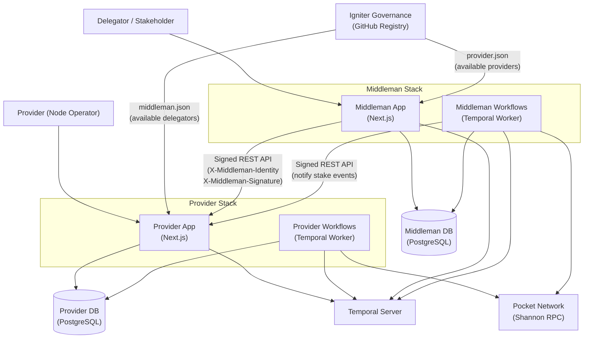
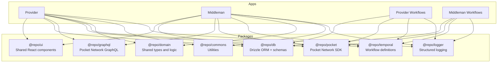

# Architecture

## System Overview

This diagram shows how Provider and Middleman interact in a deployed environment — how they discover each other, communicate, and connect to external infrastructure.

### How the pieces connect

**Discovery — Igniter Governance**

[Igniter Governance](https://github.com/pokt-network/igniter-governance) is a GitHub repository maintained by PNF that acts as a registry of known participants. It contains two JSON files:

- **`provider.json`** — A list of available providers (name, public identity, URL). Middleman fetches this to discover which providers exist and where to reach them.
- **`middleman.json`** — A list of available delegators (name, public identity). Provider fetches this to know which delegators can be trusted.

Each app can then **enable or disable** entries from the governance list — participation is not forced. Providers choose which delegators they accept, and delegators choose which providers they work with.

> In local development, a governance nginx container serves these files to replicate the same behavior.

**Communication — Signed REST API**

Middleman communicates with Provider through HTTP requests signed with its identity key. Every request includes:

- `X-Middleman-Identity` — Middleman's public key
- `X-Middleman-Signature` — Cryptographic signature of the request payload

Provider validates the signature against the identities it has enabled from the governance list. This is how Middleman queries stake configurations, notifies of completed stakes, requests supplier imports, and more.

Currently, only requests from Middleman to Provider are signed. Signed responses from Provider back to Middleman are planned — once implemented, Middleman will also verify Provider's identity on every response, closing the security loop on both ends of the communication.

**Databases — Separate by design**

Provider and Middleman each use their own PostgreSQL database. They can run on the same PostgreSQL instance, but the data is fully isolated:

- **Provider DB** — Keys (encrypted), address groups, relay miners, delegator settings, supplier state. This database holds sensitive cryptographic material.
- **Middleman DB** — User accounts, provider references, staking transactions, application settings.

**Workflows — Temporal**

Both apps use Temporal for long-running operations, each in its own namespace and task queue:

| App | Namespace | Task Queue | Example Workflows |
|-----|-----------|------------|-------------------|
| Provider | `provider` | `provider-operations` | Supplier status checks, remediation |
| Middleman | `middleman` | `middleman-operations` | Execute transactions, pending transaction processing, provider health checks |

Middleman workflows handle the full staking lifecycle — signing transactions, broadcasting to the blockchain, waiting for confirmation, and notifying Provider of the result.

Both workers also run a **schedule watchdog** (`@repo/temporal`) alongside their normal Temporal worker: a self-heal loop that periodically checks whether every schedule it owns is still firing on time, and revives ones that have gone silent (a stuck task queue, a wedged server) through a bounded, non-destructive heal ladder. It can run in `observe` (log-only) or `enforce` mode, and its state — attempts, health — is surfaced in each app's admin Workflows UI. See [Schedule Watchdog](./reference/schedule-watchdog.md) for details.

---

## Monorepo Packages

Both apps are built on a set of shared packages to keep behavior consistent without duplicating code.

| Package | Purpose |
|---------|---------|
| `@repo/ui` | Shared React component library (buttons, tables, forms, layouts) |
| `@repo/db` | Drizzle ORM with separate schemas for Provider and Middleman |
| `@repo/graphql` | GraphQL client for querying Pocket Network on-chain data |
| `@repo/pocket` | Pocket Network SDK — RPC client, transaction signing, balance queries |
| `@repo/temporal` | Temporal worker setup, client helpers, and shared workflow utilities |
| `@repo/domain` | Shared domain types and business logic |
| `@repo/commons` | General-purpose utilities |
| `@repo/logger` | Structured logging |
