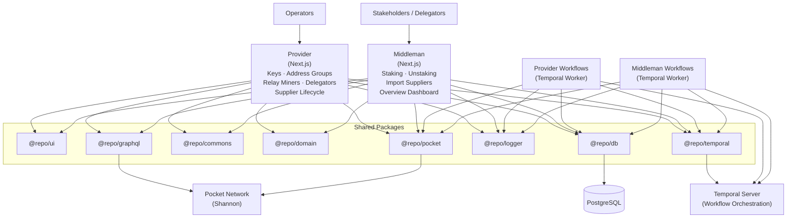

# Architecture

Igniter is a two-app monorepo built on shared packages. The diagram below shows how Provider, Middleman, and their Temporal workflow workers connect to shared infrastructure and the Pocket Network blockchain.

