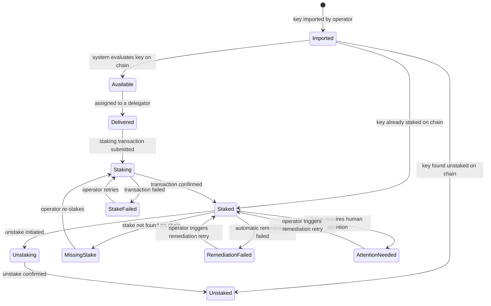

[< Back to Provider documentation](../../../apps/provider/README.md)

# Key Management

## What is Key Management?

Keys represent Pocket Network supplier addresses managed by your Provider instance. Each key is a cryptographic private key that, once staked on the Pocket Network, operates as a supplier and earns rewards. The Provider imports these keys, monitors their lifecycle as they move from import through staking and beyond, and exports them on demand.

Keys are organized into **address groups** — logical groupings that control which relay miners serve a key and how it is presented to delegators. See [address-groups.md](./address-groups.md) for how to configure groups before importing keys.

---

## Key Lifecycle

Every key you add to the Provider moves through a defined set of states. The diagram below shows the full lifecycle, including error and remediation paths.



### State Descriptions

| State | Display Name | What it means |
|-------|-------------|----------------|
| `imported` | Imported | The key was just added. The system is evaluating it against the chain to determine its actual state. |
| `available` | Available | The key is confirmed unstaked and ready to be delivered to a delegator for staking. |
| `delivered` | Delivered | The key has been assigned to a delegator's Middleman instance. A staking transaction is expected soon. |
| `staking` | Staking | A staking transaction has been submitted to the chain and is being confirmed. |
| `staked` | Staked | The key is active as a supplier on the Pocket Network. The system is monitoring it. |
| `stake_failed` | Stake Failed | The staking transaction failed. The operator should investigate and retry. |
| `unstaking` | Unstaking | An unstake transaction was submitted and is being confirmed. |
| `unstaked` | Unstaked | The key is no longer staked. It can be re-imported or exported. |
| `missing_stake` | Missing Stake | The key was delivered and expected to stake, but no stake was found after 24 hours. |
| `remediation_failed` | Remediation Failed | The system attempted automatic remediation (e.g. re-staking after slashing) but it did not succeed. |
| `attention_needed` | Attention Needed | The key is in an unhealthy state that requires human judgment — automatic remediation is not possible. |

### States That Require Operator Action

These states will not resolve automatically. Check the key detail view for remediation history and context:

- **Stake Failed** — The staking transaction failed. Review the error and retry staking.
- **Missing Stake** — Expected a stake but found none after 24 hours. Investigate with the delegator.
- **Remediation Failed** — Automatic remediation did not work. Review the remediation history and retry manually.
- **Attention Needed** — The system detected a condition it cannot resolve. Review the details and take manual action.

To trigger a remediation retry for `RemediationFailed` or `AttentionNeeded` keys, use the **Mark for Remediation** button on the Keys page.

---

## Import Keys

Importing adds new private keys to the Provider and assigns them to an address group. The Provider validates each key, derives its address, and stores it encrypted.

**Key format:** A JSON file containing an array of hex-encoded private keys:

```json
["<hex-private-key-1>", "<hex-private-key-2>"]
```

Each value must be a valid 64-character hex string representing a secp256k1 private key. The Provider derives the corresponding address and public key automatically.

**Steps:**

1. In the sidebar, navigate to **Keys**.
2. Click **Import** in the top-right area of the page.
3. In the **Import Addresses** panel that opens, select an **Address Group** from the dropdown. The group's name and visibility (public or private) are shown below the selector.
4. Drag and drop your keys JSON file onto the upload area, or click to browse.
5. Click **Import Keys**. A progress dialog shows two stages:
   - **Validating File** — the file format and each key are checked.
   - **Importing Keys** — validated keys are saved to the database.
6. On success, the panel shows how many keys were imported and the address group name. Click **Close** to return to the Keys list.

**Common errors:**

- _Invalid file_ — the file is not valid JSON or contains keys that fail validation. Check the format.
- _Keys already exist_ — one or more keys in the file are already in the system. Use a different file.

<!-- SCREENSHOT: Capture the Import panel with an address group selected and the upload area visible. Then capture the success screen showing the key count. -->
<!--  -->

---

## View and Filter Keys

The Keys page shows all keys currently in the Provider, with their address, address group, owner, state, delegator, and when they were created.

**Steps:**

1. In the sidebar, navigate to **Keys**.
2. The table shows all keys. Columns include: **Address**, **Address Group**, **Owner**, **State**, **Delivered To**, **Created At**.
3. Use the filter bar above the table to filter by:
   - **State** — filter to a specific lifecycle state (e.g., show only `Staked` or `Attention Needed` keys).
   - **Address Group** — show keys belonging to a specific group.
4. To view full details of a key, click the arrow button at the right of any row. A detail panel opens showing:
   - Address, balance, owner, stake owner (if different from owner), delivered-to delegator, last updated blockchain height.
   - Stake amount (for staked keys).
   - Delegator rewards address and revenue share percentage.
   - Remediation history (for keys with issues).

<!-- SCREENSHOT: Capture the Keys table with the state filter expanded showing all available states. Then capture the key detail panel for a staked key showing its stake amount and delegator rewards details. -->
<!--  -->

---

## Export Keys

Exporting downloads a JSON file containing the private keys for a given address group, optionally filtered to a specific state. Use this to move keys to a relay miner configuration or to back them up.

**Steps:**

1. In the sidebar, navigate to **Keys**.
2. Click **Export** in the top-right area of the page.
3. In the **Export Addresses** panel, select an **Address Group** from the dropdown.
4. Select a **Key State** to filter which keys are included (e.g., export only `Available` keys or `Staked` keys).
5. The panel shows the group name, visibility, and the number of keys that match your selection.
6. Click **Export Keys**. The browser downloads a JSON file named after the group and the export timestamp.
7. On success, the panel shows how many keys were exported. Click **Close** to return to the Keys list.

**Output format:** The exported JSON is an array of objects with hex private keys:

```json
[
  { "hex": "<private-key-1>" },
  { "hex": "<private-key-2>" }
]
```

The filename format is: `{group-name}-keys-at-{timestamp}.json`

<!-- SCREENSHOT: Capture the Export panel with a group and state selected, showing the keys-to-export count. Then capture the success screen. -->
<!--  -->

---

## Key States Reference

All 11 key states from the `KeyState` enum, with display names and operator guidance:

| State | Display Name | Operator Action Required? | Notes |
|-------|-------------|--------------------------|-------|
| `imported` | Imported | No | System evaluates the key against the chain. Resolves automatically. |
| `available` | Available | No | Key is ready for delivery. Will be picked up automatically when a delegator requests suppliers. |
| `delivered` | Delivered | No | Assigned to a delegator. A staking transaction is expected. |
| `staking` | Staking | No | Transaction submitted. Waiting for chain confirmation. |
| `staked` | Staked | No | Actively operating as a supplier. |
| `stake_failed` | Stake Failed | **Yes** | Staking transaction failed. Review and retry. |
| `unstaking` | Unstaking | No | Unstake transaction submitted. Resolves automatically. |
| `unstaked` | Unstaked | No | Key is no longer staked. Available for export or re-use. |
| `missing_stake` | Missing Stake | **Yes** | Expected stake not found after 24 hours. Investigate with delegator. |
| `remediation_failed` | Remediation Failed | **Yes** | Auto-remediation failed. Review remediation history, then use Mark for Remediation. |
| `attention_needed` | Attention Needed | **Yes** | System cannot auto-resolve. Review key details and take manual action. |

### Transient vs. Stable States

- **Transient** (resolve automatically): `Imported`, `Staking`, `Unstaking`
- **Stable active**: `Available`, `Delivered`, `Staked`, `Unstaked`
- **Require action**: `StakeFailed`, `MissingStake`, `RemediationFailed`, `AttentionNeeded`

---

## Related

- [Address Groups](./address-groups.md) — Organize keys into groups for relay miner assignment and delegator delivery.

---

**See also:** [Relay Miners](./relay-miners.md) · [Address Groups](./address-groups.md) · [Delegators](./delegators.md)
